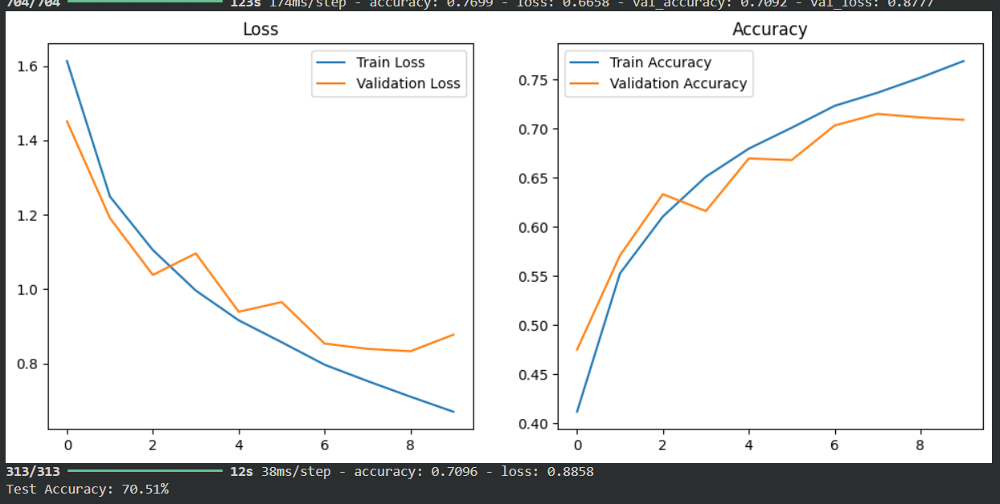

<h1 align="center">NHẬN DIỆN KHUÔN MẶT KẾT HỢP VỚI KHẨU TRANG </h1>

<div align="center">

<p align="center">
  
    
</p>

[](https://www.facebook.com/DNUAIoTLab)
[](https://fitdnu.net/)
[](https://dainam.edu.vn)
</div>

<h2 align="center">Sử Dụng 3D CNN Để Nhận Diện Khuôn Mặt Cùng Kết Hợp Với Khẩu Trang</h2>

<p align="left">
Nhận diện khuôn mặt bằng 3D Convolutional Neural Network (3D CNN) là một ứng dụng tiên tiến của công nghệ AI trong việc phân tích và nhận diện khuôn mặt. Công nghệ này sử dụng mạng nơ-ron tích chập 3D để phân tích các đặc điểm không gian và thời gian của khuôn mặt, cho phép hệ thống nhận diện chính xác ngay cả khi có sự thay đổi về ánh sáng, góc nhìn hoặc có vật cản như khẩu trang
</p>


<p align="left">
Cách thức hoạt động 3D CNN mở rộng mạng CNN 2D truyền thống bằng cách thêm một chiều thời gian hoặc chiều sâu.
Đầu vào của mạng là dữ liệu ảnh 3D (bao gồm thông tin về chiều sâu và kết cấu của khuôn mặt).
Mỗi lớp tích chập (convolutional layer) trong 3D CNN thực hiện các phép tính trên cả ba chiều (chiều cao, chiều rộng và chiều sâu) để trích xuất các đặc trưng phức tạp hơn.
Sau khi qua các lớp tích chập và pooling, các đặc trưng được đưa vào lớp Fully Connected để phân loại hoặc xác định danh tính khuôn mặt.
</p>


## 🌟 Giới thiệu
3D CNN (Three-Dimensional Convolutional Neural Network) là một loại mạng nơ-ron tích chập (Convolutional Neural Network - CNN) được mở rộng để xử lý dữ liệu có thêm chiều thứ ba (depth). <br>
Nếu như CNN thông thường chỉ hoạt động trên dữ liệu 2D (chiều rộng và chiều cao), thì 3D CNN mở rộng ra thành chiều sâu để xử lý dữ liệu có tính chất không gian và thời gian.
<br>
---
## 🏗️ HỆ THỐNG
<p align="center">
  
</p>

---


## 🛠️ CÔNG NGHỆ SỬ DỤNG

<div align="center">

<p align="center">
  
</p>
</div>

- **Python**  
- **TensorFlow / PyTorch**  
- **OpenCV**  
- **NumPy**  
- **Matplotlib**  
##  Yêu cầu hệ thống

-Có thể sử dụng Visual nếu máy đủ khoẻ 
<br>
or
<br>
-Sử dụng <a href="https://colab.google/" target="_blank">Colab</a> cho nhanh

## 🚀 Hướng dẫn cài đặt và chạy


 <h2>Bước 1: Thu thập dữ liệu</h2>
  <p> Thu thập dữ liệu hình ảnh hoặc video về khuôn mặt có và không có khẩu trang.<br>
   Có thể sử dụng các bộ dữ liệu sẵn có như **MaskedFace-Net** hoặc **RMFD**.  
👉 Dataset: [MaskedFace-Net](https://www.kaggle.com/laurentmih/maskedface-net)  
  </p>
    <h2>Bước 2: Chuẩn bị môi trường làm việc </h2>
    Trên **Google Colab** hoặc máy tính cục bộ, cài đặt các thư viện cần thiết:  
    
```bash
!pip install tensorflow keras opencv-python matplotlib numpy
```
   <p>Dataset </p><a href="https://universe.roboflow.com/ttnt-nyz2m/ai-fxy4m/dataset/2" target="_blank">Tại Đây</a> 
    <h2>Bước 3:  Xây dựng mô hình 3D CNN</h2>
    <p>Để tải dữ liệu lên Google Drive, bạn có thể sử dụng giao diện web hoặc API.</p>
    
    import tensorflow as tf
    from tensorflow.keras import layers, models
    model = models.Sequential()
    
    # Layer tích chập 3D
    model.add(layers.Conv3D(32, (3, 3, 3), activation='relu', input_shape=(64, 64, 30, 1)))
    model.add(layers.MaxPooling3D((2, 2, 2)))
    
    model.add(layers.Conv3D(64, (3, 3, 3), activation='relu'))
    model.add(layers.MaxPooling3D((2, 2, 2)))
    
    model.add(layers.Conv3D(128, (3, 3, 3), activation='relu'))
    model.add(layers.MaxPooling3D((2, 2, 2)))
    
    # Flatten và Fully Connected Layer
    model.add(layers.Flatten())
    model.add(layers.Dense(256, activation='relu'))
    model.add(layers.Dropout(0.5))
    model.add(layers.Dense(2, activation='softmax'))  # 2 lớp đầu ra: có và không có khẩu trang

    # Compile model
    model.compile(optimizer='adam', loss='categorical_crossentropy', metrics=['accuracy'])

    model.summary()

  <h2>Bước 4:  Chuẩn bị dữ liệu huấn luyện </h2>
    <p>Truy cập vào Google Colab để thực hiện huấn luyện mô hình 3D CNN.</p>
    <p>Bạn có thể tham khảo Cobal của chúng tôi ở đây</p> <a 
    href="https://colab.research.google.com/drive/16UQlO2zOYBssLDlA1bMMzwgKP1V4yEBA#scrollTo=ncRjJBLV6AM_">Tại Đây</a> 
    
       import os
      import numpy as np
      from tensorflow.keras.preprocessing.image import load_img, img_to_array
      # Tạo dữ liệu từ các thư mục
      def load_dataset(path):
          data = []
          labels = []
          for folder in os.listdir(path):
              for file in os.listdir(os.path.join(path, folder)):
                  img = load_img(os.path.join(path, folder, file), target_size=(64, 64))
                  img_array = img_to_array(img)
                  data.append(img_array)
                  labels.append(0 if folder == 'without_mask' else 1)
          return np.array(data), np.array(labels)
    X, y = load_dataset('/content/drive/MyDrive/dataset')
    X = X / 255.0

  <h2>Bước 5: Huấn luyện mô hình</h2>
    <p>Huấn luyện mô hình với dữ liệu đã được xử lý </p>
    
     history = model.fit(X, y, epochs=30, batch_size=16, validation_split=0.2)

  <h2>Bước 6: Đánh giá mô hình</h2>
    <p>Kiểm tra độ chính xác trên tập kiểm tra:</p>
    
      loss, accuracy = model.evaluate(X, y)
      print(f'Loss: {loss:.4f}, Accuracy: {accuracy:.4f}')
<br>
    <h2>Bước 7: Dự đoán và nhận diện</h2>
    <p>Dự đoán trên ảnh mới::</p>
    
      import cv2
      img = cv2.imread('/content/test_image.jpg')
      img = cv2.resize(img, (64, 64))
      img = np.expand_dims(img, axis=0) / 255.0
      
      prediction = model.predict(img)
      if prediction[0][0] > prediction[0][1]:
          print("Không đeo khẩu trang")
      else:
          print("Đeo khẩu trang")

<br>

## 🤝 Đóng góp
Dự án được phát triển bởi 3 thành viên:

| Họ và Tên                | Vai trò                  |
|--------------------------|--------------------------|
| Vũ Ngọc Tiến            | Phát triển toàn bộ mã nguồn,kiểm thử, triển khai dự án , thuyết trình, đề xuất cải tiến.|
| Lương Anh Vũ            | Biên soạn tài liệu Overleaf ,hỗ trợ bài tập lớn.|
| Lê Nguyễn Khánh Tùng    | Hỗ trợ bài tập lớn ,Powerpoint và thực hiện video giới thiệu.  |

© 2025 NHÓM 3, CNTT 17-15, TRƯỜNG ĐẠI HỌC ĐẠI NAM
